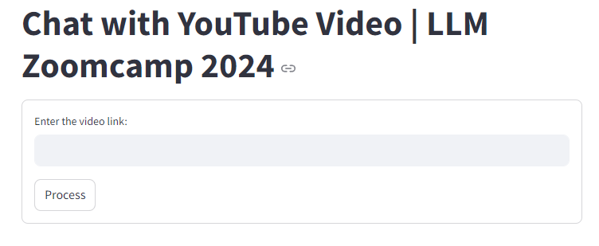
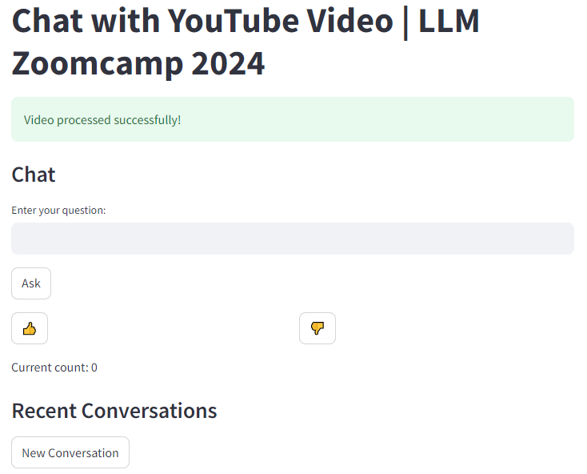
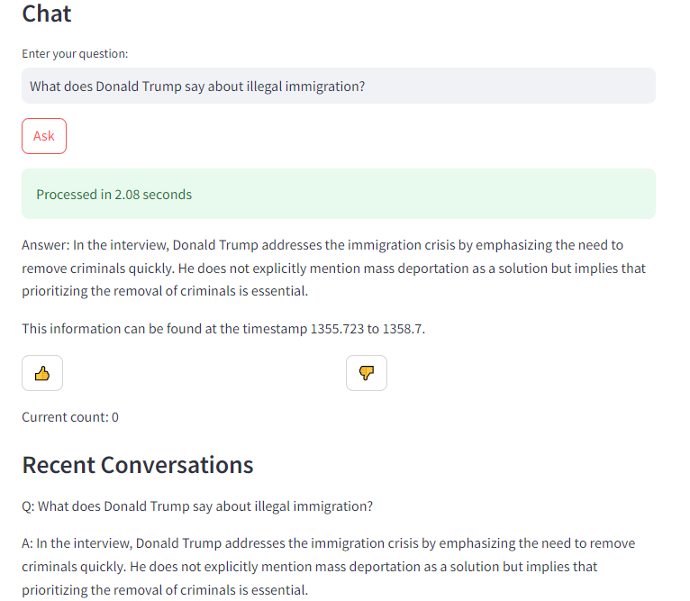
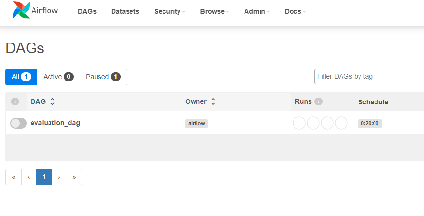
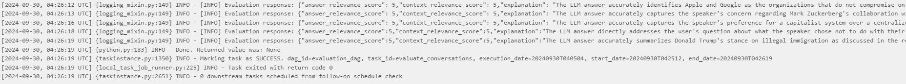
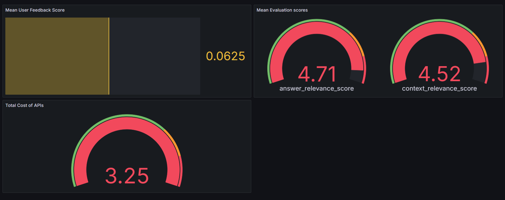

# Demo with Screenshots

## Table of Contents

1. [Streamlit Interface](#streamlit-interface)
   1. [Video Input Screen](#video-input-screen)
   2. [A chat with Donald Trump interview video](#chat-example-donald-trump-interview)
2. [Airflow UI](#airflow-ui)
   1. [DAGs Overview](#dags-overview)
   2. [Evaluation DAG Logs](#evaluation-dag-logs)
3. [Grafana UI](#grafana-ui)
   1. [Mean User Feedback Score](#mean-user-feedback-score)
   2. [Mean Evaluation Scores](#mean-evaluation-scores)
   3. [Total cost of APIs](#total-cost-of-apis)

## Streamlit Interface

### Video Input Screen

The initial screen of the application allows users to input a YouTube video link. It features:
- A text input field labeled "Enter the video link:"
- A "Process" button to initiate video processing

### Chat Example: Donald Trump Interview
**Link to the video**: [Donald Trump interview video](https://www.youtube.com/watch?v=qCbfTN-caFI).

This screenshot shows the interface after a user has asked a question:
- The question "What does Donald Trump say about illegal immigration?" is displayed in the input field
- A green message shows "Processed in 2.08 seconds"
- The answer provides a summary of Donald Trump's stance on immigration from the video
- The answer includes a timestamp reference (1355.723 to 1358.7)
- The "Recent Conversations" section now displays the question and answer

## Airflow UI

### DAGs Overview

The Airflow interface shows our DAG (Directed Acyclic Graph) setup:

- We have one DAG named `evaluation_dag`
- The DAG is owned by the "airflow" user
- It's scheduled to run every 20 minutes (0:20:00)

### Evaluation DAG Logs

These logs show the execution of our evaluation DAG.

## Grafana UI

The dashboard is divided into three main sections, each providing insights from the main 3 tables in our Postgres Database.

### Mean User Feedback Score

This metric shows the average feedback received from users. `(-1 and +1 for negative and positive feedbacks respectively)`

### Mean Evaluation Scores

Two gauge charts display the mean scores from our automated LLM evaluation process. Max Score is 5.

### Total cost of APIs

A gauge chart shows the total cost associated with API in US dollars.
